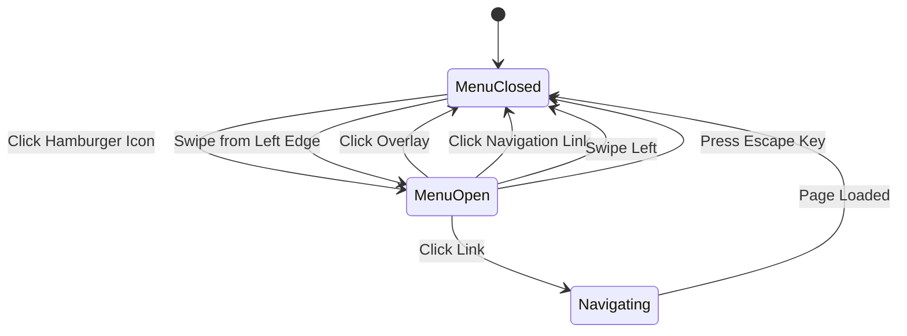

# Design Document: Hamburger Menu and About Page

## Overview

This design implements a responsive navigation system for the inventory web application using a hamburger menu pattern and creates a new About page. The solution leverages Next.js App Router for routing, React hooks for state management, and Tailwind CSS for styling to maintain consistency with the existing application design.

The hamburger menu will be implemented as a client-side component that slides in from the left, with proper touch gesture support for mobile devices. The navigation will be integrated into a new layout component that wraps all pages, ensuring consistent navigation across the application.

## Architecture

### Component Hierarchy

```
RootLayout (app/layout.tsx)
├── NavigationBar (new component)
│   ├── HamburgerIcon
│   └── AppTitle
├── NavigationMenu (new component)
│   ├── MenuOverlay
│   └── MenuContent
│       ├── NavigationLink (Home)
│       └── NavigationLink (About)
└── Page Content
    ├── Inventory Page (/)
    └── About Page (/about)
```

### Navigation Flow



## Components and Interfaces

### 1. NavigationBar Component

A fixed top bar containing the hamburger menu icon and application title.

**Props:**
```typescript
interface NavigationBarProps {
  onMenuToggle: () => void;
  isMenuOpen: boolean;
}
```

**Responsibilities:**
- Display hamburger menu icon with animation (transforms to X when open)
- Display application title
- Handle menu toggle click events
- Provide visual feedback for touch interactions

**Styling:**
- Fixed position at top of viewport
- Background: #3282B8 (primary blue)
- Height: 64px
- Z-index: 40 (above content, below menu)

### 2. NavigationMenu Component

A slide-in menu panel with navigation links and overlay.

**Props:**
```typescript
interface NavigationMenuProps {
  isOpen: boolean;
  onClose: () => void;
  currentPath: string;
}
```

**Responsibilities:**
- Render menu overlay and content
- Handle touch gestures (swipe to open/close)
- Manage menu animations (slide-in/out)
- Prevent body scroll when open
- Handle keyboard events (Escape key)

**Styling:**
- Menu panel: 280px width, white background, slide from left
- Overlay: Full screen, rgba(0, 0, 0, 0.5)
- Z-index: 50 (above all content)
- Transition: 300ms ease-in-out

### 3. NavigationLink Component

Individual navigation items within the menu.

**Props:**
```typescript
interface NavigationLinkProps {
  href: string;
  label: string;
  icon?: React.ReactNode;
  isActive: boolean;
  onClick: () => void;
}
```

**Responsibilities:**
- Render navigation link with icon
- Highlight active page
- Handle click events
- Provide touch feedback

**Styling:**
- Active state: Background #BBE1FA, text #0F4C75, left border #3282B8
- Hover state: Background #F0F8FF
- Padding: 16px 24px
- Font size: 16px, medium weight

### 4. AboutPage Component

A new page displaying application information.

**Props:**
```typescript
// Server component, no props needed
```

**Content Structure:**
- Application name and logo
- Version number
- Description of features
- RFID capabilities information
- Credits section
- Back to home link

**Styling:**
- Consistent with InventoryClient styling
- Background: #BBE1FA
- Card-based layout with white backgrounds
- Responsive padding and spacing

### 5. NavigationProvider Component

A client component that manages navigation state across the application.

**State:**
```typescript
interface NavigationState {
  isMenuOpen: boolean;
  currentPath: string;
}
```

**Methods:**
```typescript
interface NavigationContextValue {
  isMenuOpen: boolean;
  openMenu: () => void;
  closeMenu: () => void;
  toggleMenu: () => void;
}
```

## Data Models

### Navigation Configuration

```typescript
interface NavigationItem {
  id: string;
  label: string;
  href: string;
  icon?: string; // Emoji or icon identifier
}

const navigationItems: NavigationItem[] = [
  {
    id: 'home',
    label: 'หน้าหลัก',
    href: '/',
    icon: '🏠'
  },
  {
    id: 'about',
    label: 'เกี่ยวกับ',
    href: '/about',
    icon: 'ℹ️'
  }
];
```

### Application Metadata

```typescript
interface AppMetadata {
  name: string;
  version: string;
  description: string;
  features: string[];
  credits: {
    developer?: string;
    organization?: string;
  };
}

const appMetadata: AppMetadata = {
  name: 'Inventory System',
  version: '1.0.0',
  description: 'ระบบจัดการสินค้าพร้อม RFID Scanner',
  features: [
    'เพิ่ม แก้ไข และลบสินค้า',
    'สแกน RFID เพื่อเพิ่มจำนวนสินค้าอัตโนมัติ',
    'ดึงเพื่อรีเฟรชข้อมูล',
    'รองรับการใช้งานบน Mobile และ Desktop'
  ],
  credits: {
    developer: 'Your Name',
    organization: 'Your Organization'
  }
};
```


## Correctness Properties

*A property is a characteristic or behavior that should hold true across all valid executions of a system—essentially, a formal statement about what the system should do. Properties serve as the bridge between human-readable specifications and machine-verifiable correctness guarantees.*

### Property 1: Menu Toggle Interaction

*For any* application state, when the hamburger menu icon is clicked, the menu state should transition from closed to open or from open to closed.

**Validates: Requirements 1.2**

### Property 2: Overlay Click Closes Menu

*For any* application state where the menu is open, clicking the menu overlay should close the navigation menu.

**Validates: Requirements 1.4**

### Property 3: Navigation Link Closes Menu

*For any* navigation link in the menu, clicking that link should close the navigation menu and navigate to the target page.

**Validates: Requirements 1.5, 5.3**

### Property 4: Menu Renders on All Pages

*For any* valid route in the application, the hamburger menu component should be rendered and accessible.

**Validates: Requirements 1.6**

### Property 5: Active Page Highlighting

*For any* page route, the corresponding navigation link in the menu should have active styling when that route is the current page.

**Validates: Requirements 2.3**

### Property 6: Color Scheme Consistency

*For any* navigation component (menu, overlay, links), the rendered styles should use only colors from the defined color scheme (#1B262C, #0F4C75, #3282B8, #BBE1FA, white, or rgba variants).

**Validates: Requirements 2.5**

### Property 7: Swipe Right Opens Menu

*For any* application state where the menu is closed, a swipe gesture from the left edge of the screen should open the navigation menu.

**Validates: Requirements 4.1**

### Property 8: Swipe Left Closes Menu

*For any* application state where the menu is open, a swipe left gesture on the menu should close the navigation menu.

**Validates: Requirements 4.2**

### Property 9: Scroll Prevention When Menu Open

*For any* application state where the menu is open, the main content body should have scroll prevention applied (overflow hidden or equivalent).

**Validates: Requirements 5.2**

### Property 10: Scroll Position Restoration

*For any* scroll position before opening the menu, closing the menu should restore the same scroll position.

**Validates: Requirements 5.4**

### Property 11: Escape Key Closes Menu

*For any* application state where the menu is open, pressing the Escape key should close the navigation menu.

**Validates: Requirements 5.5**

### Property 12: Keyboard Focus Management

*For any* sequence of Tab key presses when the menu is open, focus should move through menu items in logical order and trap focus within the menu.

**Validates: Requirements 6.2**

## Error Handling

### Navigation Errors

**Invalid Route Navigation:**
- If a navigation link points to a non-existent route, Next.js will handle with 404 page
- Menu should still close on click regardless of route validity

**State Synchronization:**
- If menu state becomes desynchronized (e.g., overlay visible but menu closed), clicking overlay should reset to closed state
- Use useEffect cleanup to ensure state consistency on unmount

### Touch Gesture Errors

**Gesture Conflicts:**
- Swipe gestures should only trigger when starting from specific zones (left edge for open, menu area for close)
- Prevent gesture conflicts with page scrolling by checking touch start position
- Use touch event preventDefault only when gesture is recognized

**Browser Compatibility:**
- Provide fallback for browsers without touch event support
- Ensure click events work as primary interaction method

### Accessibility Errors

**Focus Trap Failures:**
- If focus escapes menu while open, provide mechanism to return focus
- Ensure Escape key always works as fallback to close menu

**Screen Reader Issues:**
- Provide ARIA live region announcements for menu state changes
- Ensure all interactive elements have proper labels

## Testing Strategy

### Unit Testing Approach

Unit tests will verify specific examples, edge cases, and component rendering using Vitest and React Testing Library:

**Component Rendering Tests:**
- NavigationBar renders with hamburger icon and title
- NavigationMenu renders with correct links (Home, About)
- AboutPage renders with all required sections (name, version, description, RFID info, credits)
- Hamburger icon has minimum 44x44 pixel dimensions
- Hamburger icon has appropriate ARIA label
- Menu has white/light background color
- Overlay has semi-transparent dark rgba background

**Edge Cases:**
- Menu behavior when rapidly toggling open/close
- Navigation when clicking same page link (should still close menu)
- Gesture handling at screen boundaries
- Focus management when menu contains no focusable elements

### Property-Based Testing Approach

Property tests will verify universal behaviors across all inputs using Vitest and fast-check (minimum 100 iterations per test):

**Property Test Configuration:**
- Library: fast-check (already in dependencies)
- Iterations: 100 minimum per property
- Tag format: `// Feature: hamburger-menu-about-page, Property {N}: {description}`

**Property Test Coverage:**

1. **Menu Toggle Property** (Property 1)
   - Generate random initial menu states (open/closed)
   - Verify clicking icon toggles state correctly
   - Tag: `Feature: hamburger-menu-about-page, Property 1: Menu Toggle Interaction`

2. **Overlay Click Property** (Property 2)
   - Generate random application states with menu open
   - Verify clicking overlay always closes menu
   - Tag: `Feature: hamburger-menu-about-page, Property 2: Overlay Click Closes Menu`

3. **Navigation Link Property** (Property 3)
   - Generate random navigation items
   - Verify clicking any link closes menu and navigates
   - Tag: `Feature: hamburger-menu-about-page, Property 3: Navigation Link Closes Menu`

4. **Menu Presence Property** (Property 4)
   - Generate random valid routes
   - Verify menu component renders on each route
   - Tag: `Feature: hamburger-menu-about-page, Property 4: Menu Renders on All Pages`

5. **Active Highlighting Property** (Property 5)
   - Generate random current routes
   - Verify corresponding nav link has active styling
   - Tag: `Feature: hamburger-menu-about-page, Property 5: Active Page Highlighting`

6. **Color Scheme Property** (Property 6)
   - Generate random navigation components
   - Verify all colors match defined palette
   - Tag: `Feature: hamburger-menu-about-page, Property 6: Color Scheme Consistency`

7. **Swipe Open Property** (Property 7)
   - Generate random touch events from left edge
   - Verify menu opens on swipe right gesture
   - Tag: `Feature: hamburger-menu-about-page, Property 7: Swipe Right Opens Menu`

8. **Swipe Close Property** (Property 8)
   - Generate random touch events on open menu
   - Verify menu closes on swipe left gesture
   - Tag: `Feature: hamburger-menu-about-page, Property 8: Swipe Left Closes Menu`

9. **Scroll Prevention Property** (Property 9)
   - Generate random menu open states
   - Verify body scroll is prevented when menu open
   - Tag: `Feature: hamburger-menu-about-page, Property 9: Scroll Prevention When Menu Open`

10. **Scroll Restoration Property** (Property 10)
    - Generate random scroll positions
    - Verify scroll position restored after menu close
    - Tag: `Feature: hamburger-menu-about-page, Property 10: Scroll Position Restoration`

11. **Escape Key Property** (Property 11)
    - Generate random menu open states
    - Verify Escape key always closes menu
    - Tag: `Feature: hamburger-menu-about-page, Property 11: Escape Key Closes Menu`

12. **Focus Management Property** (Property 12)
    - Generate random menu item configurations
    - Verify Tab key moves focus through items correctly
    - Tag: `Feature: hamburger-menu-about-page, Property 12: Keyboard Focus Management`

### Integration Testing

Integration tests will verify the complete navigation flow:
- Opening menu, clicking link, verifying page navigation and menu closure
- Touch gesture flow from swipe open to navigation to swipe close
- Keyboard navigation flow using Tab and Escape keys
- State persistence across page navigations

### Test Organization

```
inventory-web/
├── tests/
│   ├── unit/
│   │   ├── components/
│   │   │   ├── NavigationBar.test.tsx
│   │   │   ├── NavigationMenu.test.tsx
│   │   │   └── NavigationLink.test.tsx
│   │   └── pages/
│   │       └── AboutPage.test.tsx
│   └── property/
│       ├── navigation-toggle.property.test.tsx
│       ├── navigation-gestures.property.test.tsx
│       ├── navigation-keyboard.property.test.tsx
│       └── navigation-state.property.test.tsx
```

### Testing Notes

- Unit tests focus on specific examples and component rendering
- Property tests verify behaviors hold across all valid inputs
- Both testing approaches are complementary and necessary
- Property tests use fast-check generators for randomized inputs
- Each property test runs minimum 100 iterations
- Tests use happy-dom for DOM simulation (already configured in project)
